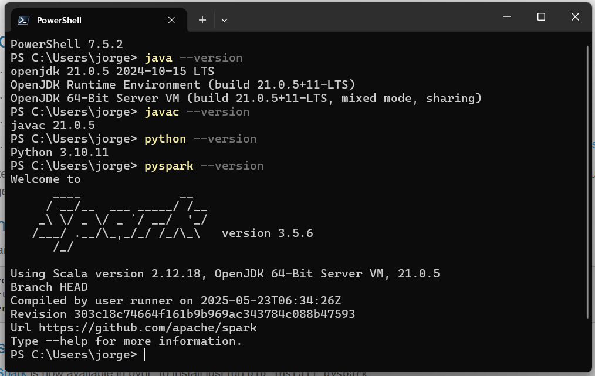

# `Setup and Install before running`

Follow this steps

# Windows install

## Chocolatey (Powershell > Run as administrator)

- https://chocolatey.org/install
- Set-ExecutionPolicy Bypass -Scope Process -Force; [System.Net.ServicePointManager]::SecurityProtocol = [System.Net.ServicePointManager]::SecurityProtocol -bor 3072; iex ((New-Object System.Net.WebClient).DownloadString('https://community.chocolatey.org/install.ps1'))

## Java & Python (Powershell > Run as administrator)

  - choco install -y liberica21jdk python310

## Spark

- Download
  - https://spark.apache.org/downloads.html
  - https://dlcdn.apache.org/spark/spark-3.5.6/spark-3.5.6-bin-hadoop3.tgz
- On Dowloads folder
  - Rename log4j2.properties.template for log4j2.properties
  - Open
  - Edit this line with `rootLogger.level = error`
  - Save & Close log4j2.properties file
- Move `spark-3.5.6-bin-hadoop3` path to C:\Program Files\

## Set Sys and Path Variables

- Sys Variables
  - PYSPARK_PYTHON: C:\Python310\python.exe
  - SPARK_HOME: C:\Program Files\spark-3.5.6-bin-hadoop3
- Path Variables
  - %PYSPARK_PYTHON%
  - %SPARK_HOME%\bin

### Windows Environment

    git clone https://github.com/GeorgeGxx/movies_project.git

    cd movies_project

    python -m venv .venv

    .\.venv\Scripts\activate

    python -m pip install --upgrade pip

    pip install -r requirements.txt

    pip list

    spark-submit contador_ratings.py

    deactivate

    rm -r .venv

## Ubuntu (WSL) install

    sudo apt install python3-pip

    sudo apt install python3.10-venv

### Ubuntu (WSL) Environment

    git clone https://github.com/GeorgeGxx/movies_project.git

    cd movies_project

    python -m venv .env

    . .env/bin/activate

    spark-submit contador_ratings.py

    deactivate

    rm -r .env

# Ubuntu OS

## apt

    sudo apt update -y && sudo apt install -y zip unzip curl wget python3-pip python3.10-venv vim

    Optional:

    sudo apt install python-is-python3 git gh

## sdkman

    https://sdkman.io/install/

    curl -s "https://get.sdkman.io" | bash

    source "$HOME/.sdkman/bin/sdkman-init.sh"

    sdk list java

    sdk install java 21.0.8-librca

    sdk use java 21.0.8-librca

    sdk uninstall java 21.0.8-librca

## Apache Spark

    wget https://dlcdn.apache.org/spark/spark-3.5.6/spark-3.5.6-bin-hadoop3.tgz

    tar xvf spark-3.5.6-bin-hadoop3.tgz

    sudo mv spark-3.5.6-bin-hadoop3 /opt/spark

    cd /opt/spark/conf

    cp log4j2.properties.template log4j2.properties

    mv log4j2.properties.template log4j2.properties-old.template

    vim log4j2.properties

    rootLogger.level = error

    vim ~/.bashrc

    i

    export SPARK_HOME=/opt/spark
    export PATH=$PATH:$SPARK_HOME/bin

    q

    :wq!

    source ~/.bashrc

    pyspark --version

### Environment

    git clone https://github.com/GeorgeGxx/movies_project.git

    cd movies_project

    python -m venv .env

    . .env/bin/activate

    python -m pip install --upgrade pip

    pip install -r requirements.txt

    pip list    

    spark-submit contador_ratings.py

    deactivate

    rm -r .env

#### Optional

    git config --global user.name <user_name>
    git config --global user.email <user_email>